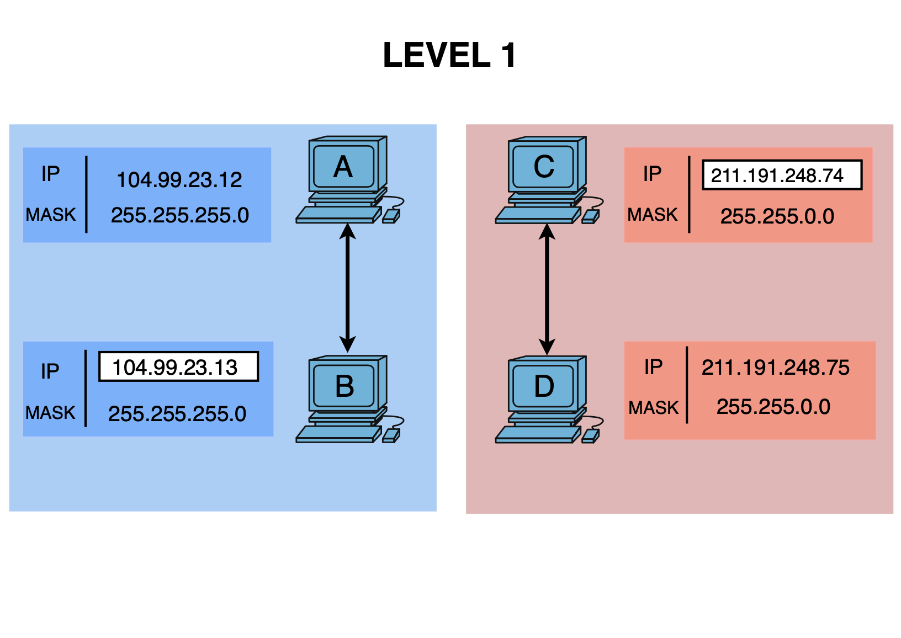

# Level 1

## Network Scheme

## 🔹 Hosts A & B

### Host A
- IP: 104.99.23.12
- Mask: 255.255.255.0 (/24)
- Network: 104.99.23.0
- Step: 256
- Broadcast: 104.99.23.255

### Host B
- IP: 104.99.23.13
- Mask: 255.255.255.0 (/24)
- Network: 104.99.23.0
- Step: 256
- Broadcast: 104.99.23.255

---

## 🔸 Analysis

- Are A and B in the same subnet: YES  
- Reason: both belong to the network `104.99.23.0/24`

---

## 🔹 Hosts C & D

### Host C
- IP: 211.191.248.74
- Mask: 255.255.0.0 (/16)
- Network: 211.191.0.0
- Step: 256 (on the 3rd octet)
- Broadcast: 211.191.255.255

### Host D
- IP: 211.191.248.75
- Mask: 255.255.0.0 (/16)
- Network: 211.191.0.0
- Step: 256 (on the 3rd octet)
- Broadcast: 211.191.255.255

---

## 🔸 Analysis

- Are C and D in the same subnet: YES  
- Reason: both belong to the network `211.191.0.0/16`

---

## ✅ Conclusion

- Goal 1: A ↔ B: OK  
- Goal 1: C ↔ D: OK
