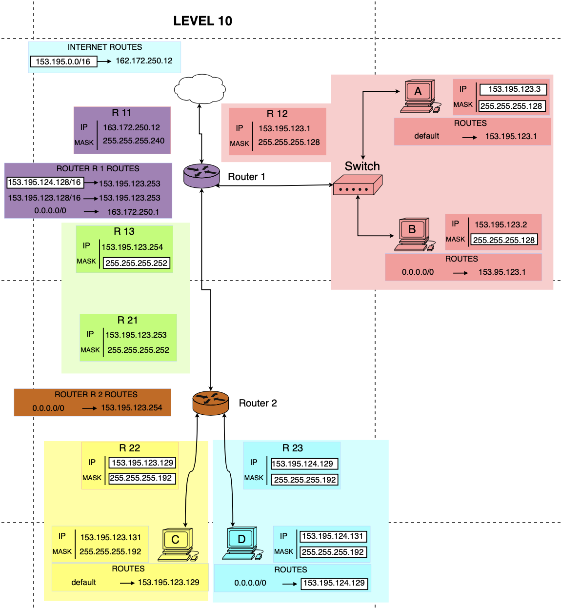

# Level 10

## Network Scheme

## Topology Overview

This level contains:

- Router 1 connected to the Internet
- Router 1 connected to LAN A/B
- Router 1 connected to Router 2 over a /30 transit link
- Router 2 connected to two LANs (C and D)

Goal: provide full connectivity between internal hosts and Internet with correct return paths.

---

## Segment 1: A/B LAN Behind Router 1

- Router 1 interface R12: 153.195.123.1/25
- Host A: 153.195.123.3/25, default gateway 153.195.123.1
- Host B: 153.195.123.2/25, default gateway 153.195.123.1

### Subnet Calculation

Mask /25 means step 128 in the last octet:

- Network: 153.195.123.0/25
- Broadcast: 153.195.123.127
- Usable range: 153.195.123.1 - 153.195.123.126

Result: R12, Host A, and Host B are in the same valid subnet.

---

## Segment 2: Router 1 to Router 2 Transit Link

- Router 1 interface R13: 153.195.123.254/30
- Router 2 interface R21: 153.195.123.253/30

### Subnet Calculation

Mask /30 means step 4:

- Network: 153.195.123.252/30
- Broadcast: 153.195.123.255
- Usable range: 153.195.123.253 - 153.195.123.254

Result: both router interfaces are valid on the same point-to-point subnet.

---

## Segment 3: C LAN Behind Router 2

- Router 2 interface R22: 153.195.123.129/26
- Host C: 153.195.123.131/26, default gateway 153.195.123.129

### Subnet Calculation

For /26:

- Network: 153.195.123.128/26
- Broadcast: 153.195.123.191
- Usable range: 153.195.123.129 - 153.195.123.190

Result: R22 and Host C are correctly configured.

---

## Segment 4: D LAN Behind Router 2

- Router 2 interface R23: 153.195.124.129/26
- Host D: 153.195.124.131/26, default gateway 153.195.124.129

### Subnet Calculation

For /26:

- Network: 153.195.124.128/26
- Broadcast: 153.195.124.191
- Usable range: 153.195.124.129 - 153.195.124.190

Result: R23 and Host D are correctly configured.

---

## Segment 5: Router 1 Internet Uplink

- Router 1 interface R11: 163.172.250.12/28
- Router 1 default route: 0.0.0.0/0 -> 163.172.250.1

### Subnet Calculation

For /28:

- Network: 163.172.250.0/28
- Broadcast: 163.172.250.15
- Usable range: 163.172.250.1 - 163.172.250.14

Result: next hop 163.172.250.1 is valid and reachable from Router 1.

---

## Routes

### Host Routes

- A: default -> 153.195.123.1
- B: 0.0.0.0/0 -> 153.195.123.1
- C: default -> 153.195.123.129
- D: 0.0.0.0/0 -> 153.195.124.129

### Router 2 Route

- 0.0.0.0/0 -> 153.195.123.254

Router 2 forwards unknown destinations to Router 1.

### Router 1 Routes

- 153.195.123.128/26 -> 153.195.123.253
- 153.195.124.128/26 -> 153.195.123.253
- 0.0.0.0/0 -> 163.172.250.1

Router 1 knows how to reach both Router 2 LANs and uses Internet as default for other traffic.

### Internet Return Route

- 153.195.0.0/16 -> 162.172.250.12

This provides return path from Internet toward internal 153.195.x.x networks.

---

## Packet Flow

### Example 1: Host A -> Host D

1. Host A sends packet to 153.195.124.131
2. A forwards to gateway 153.195.123.1 (Router 1)
3. Router 1 matches route 153.195.124.128/26 -> 153.195.123.253
4. Router 2 receives packet and forwards out R23 to Host D
5. Host D receives packet

Return path:

1. Host D sends reply to gateway 153.195.124.129
2. Router 2 forwards via default -> 153.195.123.254
3. Router 1 forwards directly to 153.195.123.0/25
4. Host A receives reply

### Example 2: Host C -> Internet

1. Host C sends packet to external destination
2. C forwards to gateway 153.195.123.129
3. Router 2 forwards via default -> 153.195.123.254
4. Router 1 forwards via default -> 163.172.250.1
5. Packet reaches Internet

Reply comes back via Internet route 153.195.0.0/16 -> 162.172.250.12, then Router 1 and Router 2 deliver it to Host C.

---

## Validation

- A/B /25 subnet valid: YES
- R1-R2 /30 transit link valid: YES
- C /26 subnet valid: YES
- D /26 subnet valid: YES
- Host gateways valid: YES
- Router 1 static routes to Router 2 LANs valid: YES
- Router 2 default route to Router 1 valid: YES
- Internet return route exists: YES

---

## Final Conclusion

Level 10 is correct when these routes are present:

- On Router 1:
	- 153.195.123.128/26 -> 153.195.123.253
	- 153.195.124.128/26 -> 153.195.123.253
	- 0.0.0.0/0 -> 163.172.250.1
- On Router 2:
	- 0.0.0.0/0 -> 153.195.123.254
- On Internet side:
	- 153.195.0.0/16 -> 162.172.250.12

Result:

- Goal 1: A <-> B        **OK**
- Goal 2: C <-> D        **OK**
- Goal 3: B <-> Internet **OK**
- Goal 4: B <-> C        **OK**
- Goal 5: A <-> D        **OK**
- Goal 6: D <-> Internet **OK**
- Goal 7: C <-> Internet **OK**