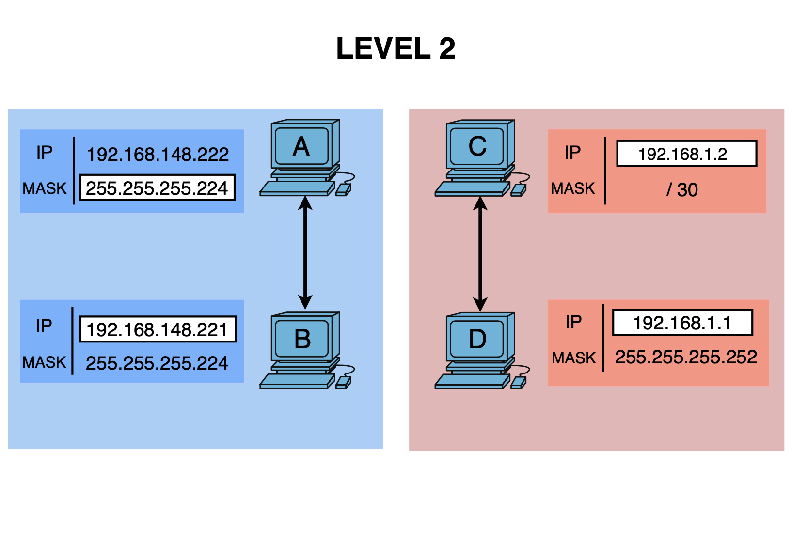

# Level 2

## Network Scheme

## 🔹 Hosts A & B

### Host A
- IP: 192.168.148.222
- Mask: 255.255.255.224 (/27)
- Network: 192.168.148.192
- Step: 32
- Broadcast: 192.168.148.223

### Host B
- IP: 192.168.148.221
- Mask: 255.255.255.224 (/27)
- Network: 192.168.148.192
- Step: 32
- Broadcast: 192.168.148.223

---

## 🔸 Analysis

- Are A and B in the same subnet: YES
- Reason: both belong to the network `192.168.148.192/27`

---

## 🔹 Hosts C & D

### Host C
- IP: 192.168.1.2
- Mask: 255.255.255.252 (/30)
- Network: 192.168.1.0
- Step: 4
- Broadcast: 192.168.1.3

### Host D
- IP: 192.168.1.1
- Mask: 255.255.255.252 (/30)
- Network: 192.168.1.0
- Step: 4
- Broadcast: 192.168.1.3

---

## 🔸 Analysis

- Are C and D in the same subnet: YES
- Reason: both belong to the network `192.168.1.0/30`

---

## ✅ Conclusion

- Goal 1: A ↔ B: OK
- Goal 2: C ↔ D: OK