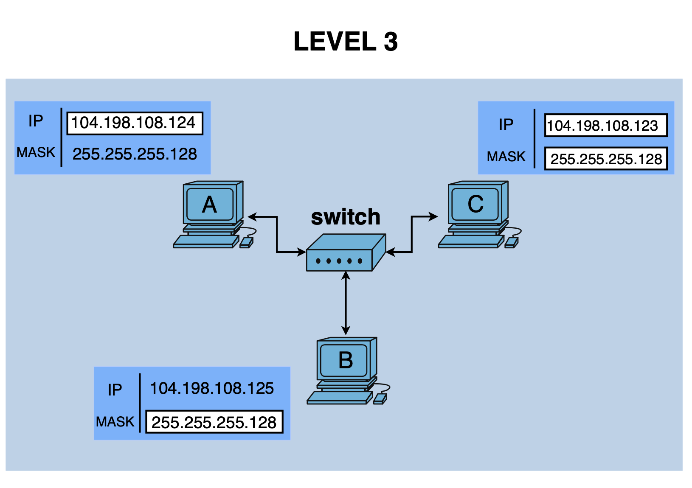

# Level 3

## Network Scheme

## 🔹 Hosts A, B & C

### Host A
- IP: 104.198.108.124
- Mask: 255.255.255.128 (/25)
- Network: 104.198.108.0
- Step: 128
- Broadcast: 104.198.108.127

### Host B
- IP: 104.198.108.125
- Mask: 255.255.255.128 (/25)
- Network: 104.198.108.0
- Step: 128
- Broadcast: 104.198.108.127

### Host C
- IP: 104.198.108.123
- Mask: 255.255.255.128 (/25)
- Network: 104.198.108.0
- Step: 128
- Broadcast: 104.198.108.127

---

## 🔸 Analysis

- Are A, B and C in the same subnet: YES
- Reason: all three hosts belong to the network `104.198.108.0/25`

---

## ✅ Conclusion

- Goal 1: A ↔ B: OK
- Goal 2: A ↔ C: OK
- Goal 3: B ↔ C: OK