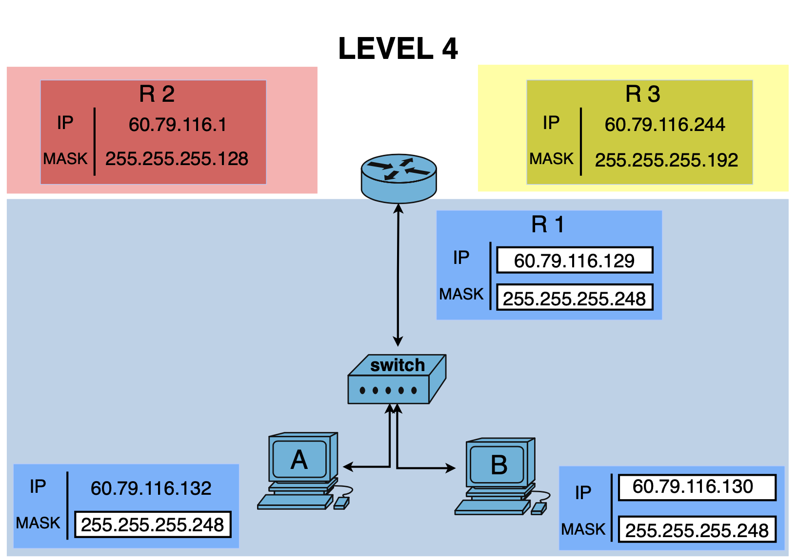

# Level 4

## Network Scheme

## 🔹 Hosts A & B (LAN via Switch)

### Host A
- IP: 60.79.116.132
- Mask: 255.255.255.248 (/29)
- Network: 60.79.116.128
- Step: 8
- Broadcast: 60.79.116.135

### Host B
- IP: 60.79.116.130
- Mask: 255.255.255.248 (/29)
- Network: 60.79.116.128
- Step: 8
- Broadcast: 60.79.116.135

---

## 🔹 Router Interface (R1 → Switch)

### Interface R1
- IP: 60.79.116.129
- Mask: 255.255.255.248 (/29)
- Network: 60.79.116.128
- Step: 8
- Broadcast: 60.79.116.135

---

## 🔸 Analysis (LAN Segment)

- Are A, B, and R1 in the same subnet: YES
- Reason: all belong to `60.79.116.128/29`

✔ Communication inside LAN: OK

---

## 🔹 Other Router Interfaces

### Interface R2
- IP: 60.79.116.1
- Mask: 255.255.255.128 (/25)
- Network: 60.79.116.0
- Step: 128
- Broadcast: 60.79.116.127

---

### Interface R3
- IP: 60.79.116.244
- Mask: 255.255.255.192 (/26)
- Network: 60.79.116.192
- Step: 64
- Broadcast: 60.79.116.255

---

## 🔸 Analysis (Whole Topology)

- LAN subnet: `60.79.116.128/29`
- R2 subnet: `60.79.116.0/25`
- R3 subnet: `60.79.116.192/26`

👉 These are **different subnets**

---

## ⚠️ Important Rule

- Devices connected through a **switch (same LAN)** must be in the **same subnet**
- Routers connect **different subnets**

---

## ❗ Key Observation

- A, B, and R1 are correctly configured in one subnet
- R2 and R3 are in separate networks

👉 This is valid only if routing is intended

---

## ✅ Conclusion

- Goal 1: A ↔ B: OK
- Goal 2: A ↔ R: OK
- Goal 3: B ↔ R: OK