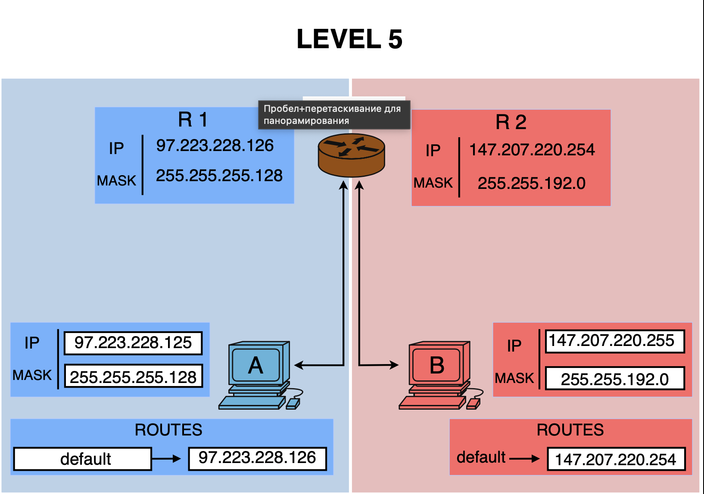

# Level 5

## Network Scheme

## Topology Overview

This level contains one router with two interfaces and two hosts:

- **Host A** is connected to **Router interface R1**
- **Host B** is connected to **Router interface R2**

The router is used to connect two different subnets.

---

## Host A

- **IP:** `97.223.228.125`
- **Mask:** `255.255.255.128`
- **Prefix:** `/25`
- **Default gateway:** `97.223.228.126`

### Subnet calculation

Mask `/25` means:

- Step = `128` in the 4th octet
- Possible ranges:
  - `0–127`
  - `128–255`

The last octet is `125`, so it belongs to the first range:

- **Network:** `97.223.228.0/25`
- **Broadcast:** `97.223.228.127`
- **Usable host range:** `97.223.228.1 – 97.223.228.126`

### Result

Host A belongs to the subnet:

`97.223.228.0/25`

---

## Router Interface R1

- **IP:** `97.223.228.126`
- **Mask:** `255.255.255.128`
- **Prefix:** `/25`

### Subnet calculation

- **Network:** `97.223.228.0/25`
- **Broadcast:** `97.223.228.127`
- **Usable host range:** `97.223.228.1 – 97.223.228.126`

### Result

Router interface R1 is in the same subnet as Host A.

---

## Host B

- **IP:** `147.207.220.255`
- **Mask:** `255.255.192.0`
- **Prefix:** `/18`
- **Default gateway:** `147.207.220.254`

### Subnet calculation

Mask `/18` means:

- Step = `64` in the 3rd octet
- Possible ranges in the 3rd octet:
  - `0–63`
  - `64–127`
  - `128–191`
  - `192–255`

The 3rd octet is `220`, so it belongs to the range:

`192–255`

That gives:

- **Network:** `147.207.192.0/18`
- **Broadcast:** `147.207.255.255`
- **Usable host range:** `147.207.192.1 – 147.207.255.254`

### Important note

Even though the last octet is `255`, this is **not** the broadcast address for this subnet.

The broadcast address is:

`147.207.255.255`

So `147.207.220.255` is a valid host address.

### Result

Host B belongs to the subnet:

`147.207.192.0/18`

---

## Router Interface R2

- **IP:** `147.207.220.254`
- **Mask:** `255.255.192.0`
- **Prefix:** `/18`

### Subnet calculation

- **Network:** `147.207.192.0/18`
- **Broadcast:** `147.207.255.255`
- **Usable host range:** `147.207.192.1 – 147.207.255.254`

### Result

Router interface R2 is in the same subnet as Host B.

---

## Router Subnets

The router connects these two subnets:

1. **Subnet on R1 side**
   - `97.223.228.0/25`

2. **Subnet on R2 side**
   - `147.207.192.0/18`

These two subnets are different and do not overlap.

---

## Communication Logic

### Host A ↔ Router R1
- Host A and Router interface R1 are in the same subnet
- Host A uses `97.223.228.126` as its default gateway

### Host B ↔ Router R2
- Host B and Router interface R2 are in the same subnet
- Host B uses `147.207.220.254` as its default gateway

### Host A ↔ Host B
- They are **not** in the same subnet
- Direct communication is **not** possible
- Communication is possible **through the router**

Path:

`Host A -> R1 -> Router -> R2 -> Host B`

---

## Final Conclusion

- **Host A subnet:** `97.223.228.0/25`
- **Host B subnet:** `147.207.192.0/18`
- **Router interface R1 subnet:** `97.223.228.0/25`
- **Router interface R2 subnet:** `147.207.192.0/18`

### Summary

- Goal 1: A ↔ Router **OK**
- Goal 2: B ↔ Router **OK**
- Goal 3: A ↔ B **OK**