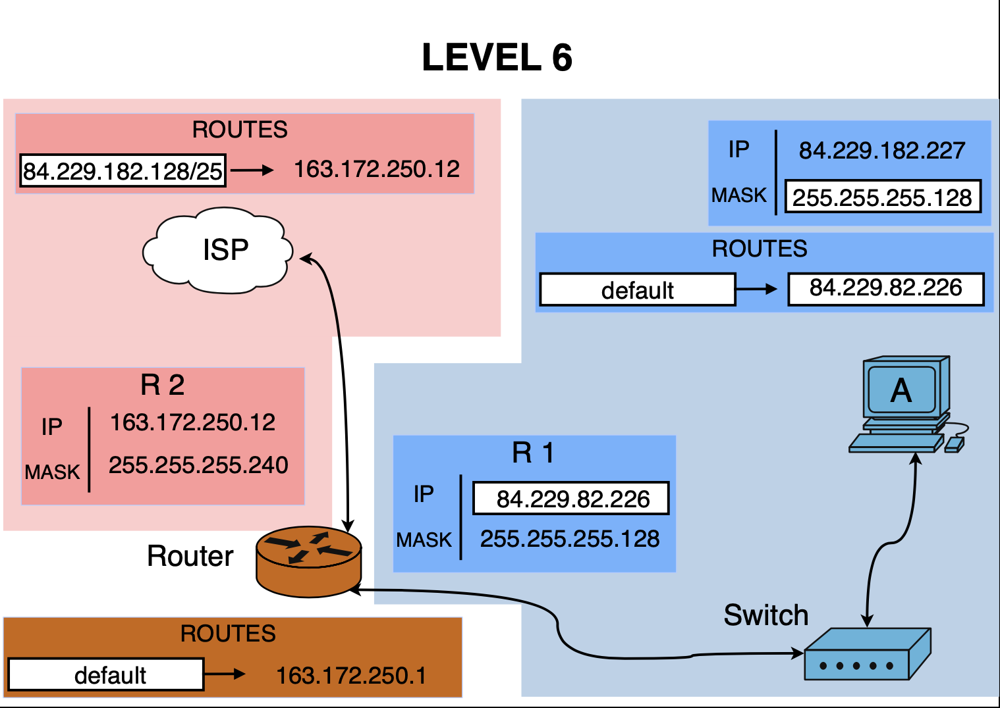

# Level 6

## Network Scheme


## Topology Overview

This level contains:

- **Host A** connected to a switch
- **Router interface R1** connected to the same switch
- **Router interface R2** connected to the Internet
- **Internet** with a route back to Host A's subnet

The goal is to allow **Host A** to communicate with the Internet.

---

## Host A

- **IP:** `84.229.182.227`
- **Mask:** `255.255.255.128`
- **Prefix:** `/25`
- **Default gateway:** `84.229.182.226`

### Subnet calculation

Mask `/25` means:

- Step = `128` in the 4th octet
- Possible ranges:
  - `0–127`
  - `128–255`

The last octet is `227`, so it belongs to:

- **Network:** `84.229.182.128/25`
- **Broadcast:** `84.229.182.255`
- **Usable host range:** `84.229.182.129 – 84.229.182.254`

### Result

Host A belongs to:

`84.229.182.128/25`

---

## Router Interface R1

- **IP:** `84.229.182.226`
- **Mask:** `255.255.255.128`
- **Prefix:** `/25`

### Subnet calculation

- **Network:** `84.229.182.128/25`
- **Broadcast:** `84.229.182.255`
- **Usable host range:** `84.229.182.129 – 84.229.182.254`

### Result

Router interface R1 is in the same subnet as Host A.

---

## Router Interface R2

- **IP:** `163.172.250.12`
- **Mask:** `255.255.255.240`
- **Prefix:** `/28`

### Subnet calculation

Mask `/28` means:

- Step = `16` in the 4th octet
- Possible ranges:
  - `0–15`
  - `16–31`
  - `32–47`
  - ...

The last octet is `12`, so it belongs to:

- **Network:** `163.172.250.0/28`
- **Broadcast:** `163.172.250.15`
- **Usable host range:** `163.172.250.1 – 163.172.250.14`

### Result

Router interface R2 belongs to:

`163.172.250.0/28`

---

## Router Routes

### Default route on Router R

```text
default -> 163.172.250.1
```

Meaning:

If the router does not have a more specific route for a destination, it sends the packet to:

`163.172.250.1`

This is the next hop toward the Internet.

### Internet Route

The Internet contains this route:

`84.229.182.128/25 -> 163.172.250.12`

Meaning:

The Internet knows that the subnet:

`84.229.182.128/25`

is reachable through:

`163.172.250.12`

This is the reverse path back to Host A’s subnet.

Without this route, Host A could send packets to the Internet, but the Internet would not know how to return the reply.

---

### Communication Path

**Forward path: Host A -> Internet**

1. Host A wants to send traffic to an external destination
2. The destination is not inside `84.229.182.128/25`
3. Host A uses its default gateway: `84.229.182.226`
4. Router R receives the packet on interface R1
5. Router R checks its routing table
6. No more specific internal route exists for the Internet destination
7. Router R uses: `default -> 163.172.250.1`
8. The packet goes out through interface R2
9. The packet reaches the Internet

**Reverse path: Internet -> Host A**

1. The Internet receives the reply packet
2. The destination is inside `84.229.182.128/25`
3. The Internet checks its routing table
4. It finds `84.229.182.128/25 -> 163.172.250.12`
5. The reply is sent to router interface R2
6. Router R receives the packet
7. Router R knows that `84.229.182.128/25` is directly connected on interface R1
8. The packet is sent through R1 toward the switch
9. The switch forwards the packet to Host A
10. Host A receives the reply

---

## Network Summary

### Internal side

- Subnet: `84.229.182.128/25`
- Network: `84.229.182.128`
- Broadcast: `84.229.182.255`
- Usable range: `84.229.182.129 - 84.229.182.254`

### External side

- Subnet: `163.172.250.0/28`
- Network: `163.172.250.0`
- Broadcast: `163.172.250.15`
- Usable range: `163.172.250.1 - 163.172.250.14`

---

## Validation

### Host A and R1

- Same subnet: **YES**
- Communication possible: **YES**

### Router and Internet

- R2 is in a valid external subnet: **YES**
- Default route exists: **YES**

### Internet and Host A

- Reverse route exists: **YES**
- Internet can send replies back: **YES**

---

## Final Conclusion

This level works because:

- Host A and Router interface R1 are in the same subnet
- Host A uses the correct default gateway
- Router R has a valid default route toward the Internet
- The Internet has a valid route back to Host A's subnet

### Result

- Goal 1: Host A <-> Internet: **OK**