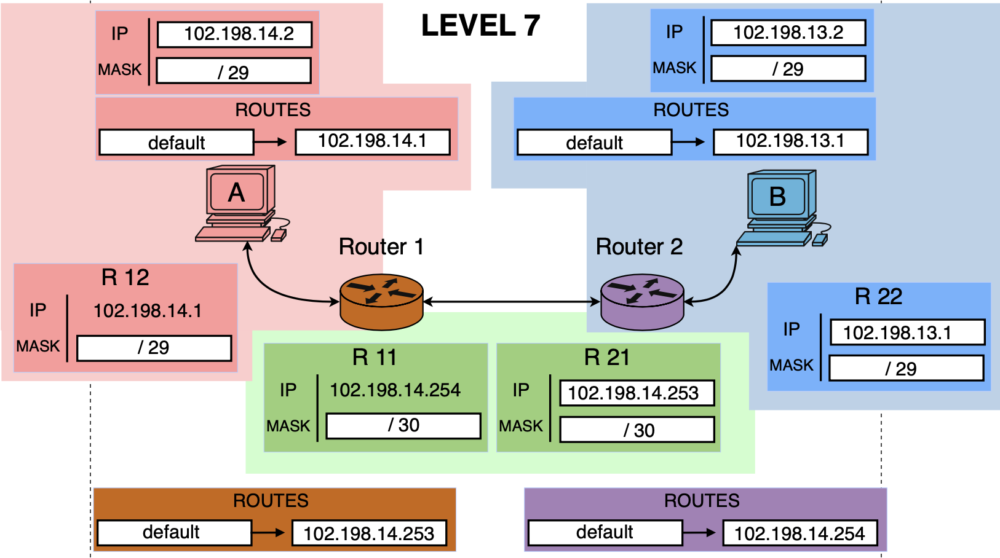

# Level 7

## Network Scheme

## Topology Overview

This level contains:

- Host A in subnet `102.198.14.0/29`
- Host B in subnet `102.198.13.0/29`
- Router 1 connected to Host A and to Router 2
- Router 2 connected to Host B and to Router 1
- A point-to-point link between routers in subnet `102.198.14.252/30`

Goal: make communication between Host A and Host B work through both routers.

---

## Host A

- IP: `102.198.14.2`
- Mask: `/29` (`255.255.255.248`)
- Default gateway: `102.198.14.1`

### Subnet Calculation

For `/29`, step is `8` in the last octet.

- Network: `102.198.14.0/29`
- Broadcast: `102.198.14.7`
- Usable range: `102.198.14.1 - 102.198.14.6`

Result: Host A is correctly configured and gateway `102.198.14.1` is in the same subnet.

---

## Host B

- IP: `102.198.13.2`
- Mask: `/29` (`255.255.255.248`)
- Default gateway: `102.198.13.1`

### Subnet Calculation

For `/29`, step is `8` in the last octet.

- Network: `102.198.13.0/29`
- Broadcast: `102.198.13.7`
- Usable range: `102.198.13.1 - 102.198.13.6`

Result: Host B is correctly configured and gateway `102.198.13.1` is in the same subnet.

---

## Router Interfaces

### Router 1 LAN Interface (R12)

- IP: `102.198.14.1`
- Mask: `/29`

This interface is in the same subnet as Host A (`102.198.14.0/29`).

### Router 2 LAN Interface (R22)

- IP: `102.198.13.1`
- Mask: `/29`

This interface is in the same subnet as Host B (`102.198.13.0/29`).

### Inter-Router Link

- Router 1 side (R11): `102.198.14.254/30`
- Router 2 side (R21): `102.198.14.253/30`

For `/30`, step is `4` in the last octet.

- Network: `102.198.14.252/30`
- Broadcast: `102.198.14.255`
- Usable range: `102.198.14.253 - 102.198.14.254`

Result: both router-to-router addresses are valid and in the same point-to-point subnet.

---

## Routes

### Host Routes

- Host A: `default -> 102.198.14.1`
- Host B: `default -> 102.198.13.1`

### Router Default Routes

- Router 1: `default -> 102.198.14.253`
- Router 2: `default -> 102.198.14.254`

These defaults send unknown traffic across the inter-router link to the other router.

---

## Packet Flow

### Forward Path (A -> B)

1. Host A sends packet to Host B (`102.198.13.2`)
2. Destination is outside `102.198.14.0/29`, so Host A uses default gateway `102.198.14.1`
3. Router 1 receives packet and forwards it via default route to `102.198.14.253` (Router 2)
4. Router 2 sees destination in directly connected subnet `102.198.13.0/29`
5. Router 2 sends packet to Host B

### Return Path (B -> A)

1. Host B sends reply to Host A (`102.198.14.2`)
2. Destination is outside `102.198.13.0/29`, so Host B uses default gateway `102.198.13.1`
3. Router 2 forwards packet via default route to `102.198.14.254` (Router 1)
4. Router 1 sees destination in directly connected subnet `102.198.14.0/29`
5. Router 1 sends packet to Host A

---

## Validation

- Host A and Router 1 (R12) same subnet: **YES**
- Host B and Router 2 (R22) same subnet: **YES**
- Inter-router link valid `/30`: **YES**
- Host A default gateway valid: **YES**
- Host B default gateway valid: **YES**
- End-to-end A <-> B communication: **YES**

---

## Final Conclusion

Level 7 is correctly configured:

- Both LAN segments use valid `/29` addressing
- Router interconnect uses a valid `/30` point-to-point subnet
- Default routes on hosts and routers are consistent

Result:

- Goal 1: A <-> B: **OK**
