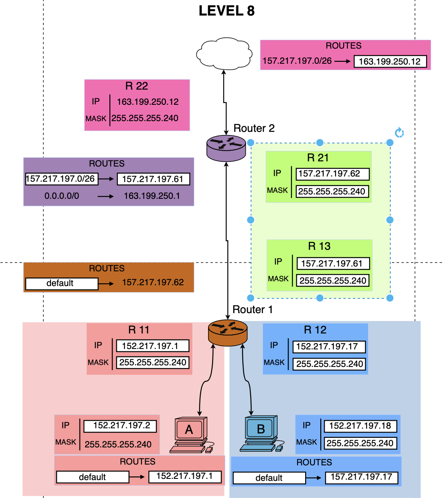

# Level 8

## Network Scheme

## Topology Overview

This level contains:

- Host A connected to Router 1
- Host B connected to Router 1 on a different LAN
- Router 1 connected to Router 2 through transit subnet
- Router 2 connected to upstream network (Internet side)
- A return route on the Internet side back to internal networks

Goal: allow Host A and Host B to reach external networks, and ensure replies can return.

---

## Host A Segment

- Host A IP: 152.217.197.2
- Host A mask: 255.255.255.240 (/28)
- Host A default gateway: 152.217.197.1
- Router 1 interface R11: 152.217.197.1/28

### Subnet Calculation

For /28, step is 16 in the last octet.

- Network: 152.217.197.0/28
- Broadcast: 152.217.197.15
- Usable range: 152.217.197.1 - 152.217.197.14

Result: Host A and R11 are in the same subnet, gateway is valid.

---

## Host B Segment

- Host B IP: 152.217.197.18
- Host B mask: 255.255.255.240 (/28)
- Router 1 interface R12: 152.217.197.17/28
- Host B default gateway should be: 152.217.197.17

### Subnet Calculation

For /28, step is 16 in the last octet.

- Network: 152.217.197.16/28
- Broadcast: 152.217.197.31
- Usable range: 152.217.197.17 - 152.217.197.30

Result: Host B and R12 are in the same subnet, gateway is valid when set to 152.217.197.17.

---

## Router 1 <-> Router 2 Transit Segment

- Router 1 interface R13: 157.217.197.61/28
- Router 2 interface R21: 157.217.197.62/28

### Subnet Calculation

For /28, step is 16 in the last octet.

- Network: 157.217.197.48/28
- Broadcast: 157.217.197.63
- Usable range: 157.217.197.49 - 157.217.197.62

Result: both transit interfaces are valid in the same subnet.

---

## Router 2 External Segment

- Router 2 interface R22: 163.199.250.12/28
- Upstream next hop: 163.199.250.1

### Subnet Calculation

For /28:

- Network: 163.199.250.0/28
- Broadcast: 163.199.250.15
- Usable range: 163.199.250.1 - 163.199.250.14

Result: external next hop 163.199.250.1 is reachable from R22.

---

## Routes

### Host Routes

- Host A: default -> 152.217.197.1
- Host B: default -> 152.217.197.17

### Router 1 Route

- default -> 157.217.197.62

Router 1 sends unknown destinations to Router 2.

### Router 2 Routes

- 157.217.197.0/26 -> 157.217.197.61
- 0.0.0.0/0 -> 163.199.250.1

This gives Router 2 both:

- a route back to internal networks via Router 1
- a default route toward upstream Internet

### Upstream Return Route

- 157.217.197.0/26 -> 163.199.250.12

This is required so replies from outside return to Router 2.

---

## Packet Flow

### Forward Path (Host A -> Internet)

1. Host A sends packet to external destination
2. Destination is outside local subnet, so Host A uses gateway 152.217.197.1
3. Router 1 forwards by default to 157.217.197.62 (Router 2)
4. Router 2 forwards by default to 163.199.250.1
5. Packet reaches upstream network

### Return Path (Internet -> Host A)

1. Upstream receives reply packet to internal destination
2. Upstream uses route 157.217.197.0/26 -> 163.199.250.12
3. Router 2 receives packet on R22
4. Router 2 sends internal destinations to 157.217.197.61
5. Router 1 receives and forwards to Host A subnet
6. Host A receives reply

The same logic applies to Host B through subnet 152.217.197.16/28.

---

## Validation

- Host A LAN addressing valid: YES
- Host B LAN addressing valid: YES
- Transit subnet between routers valid: YES
- Router 2 upstream subnet valid: YES
- Default routes chain correctly from Router 1 to upstream: YES
- Reverse path from upstream back to internal network exists: YES

---

## Final Conclusion

Level 8 works when:

- Host B gateway is set to 152.217.197.17
- Router 1 default route points to 157.217.197.62
- Router 2 has internal route to 157.217.197.0/26 via 157.217.197.61
- Router 2 default route points to 163.199.250.1
- Upstream has return route 157.217.197.0/26 -> 163.199.250.12

Result:

- Goal 1: A <-> B: **OK**
- Goal 2: A <-> Network: **OK**
- Goal 3: A <-> Network: **OK**