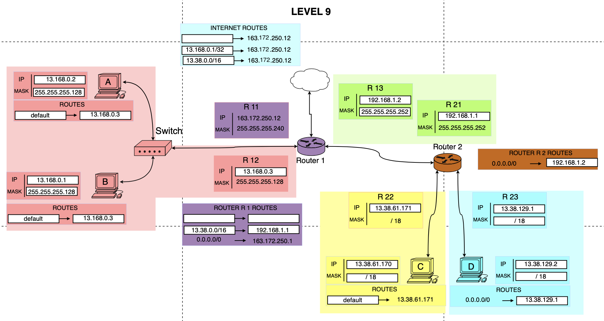

# Level 9

## Network Scheme

## Topology Overview

This level contains:

- Left LAN with Host A and Host B behind Router 1
- Router 1 uplink to Internet
- Point-to-point link between Router 1 and Router 2
- Two LANs behind Router 2 (Host C and Host D)

Goal: make end-to-end connectivity work across both routers and Internet return routes.

---

## Left LAN (A and B)

- Host A: `13.168.0.2/25`, gateway `13.168.0.3`
- Host B: `13.168.0.1/25`, gateway `13.168.0.3`
- Router 1 interface R12: `13.168.0.3/25`

### Subnet Calculation

Mask `/25` means step `128` in the 4th octet:

- Network: `13.168.0.0/25`
- Broadcast: `13.168.0.127`
- Usable range: `13.168.0.1 - 13.168.0.126`

Result: A, B, and R12 are in the same subnet, and host gateways are valid.

---

## Router 1 External Interface

- Router 1 interface R11: `163.172.250.12/28`
- Router 1 default route: `0.0.0.0/0 -> 163.172.250.1`

### Subnet Calculation

For `/28`:

- Network: `163.172.250.0/28`
- Broadcast: `163.172.250.15`
- Usable range: `163.172.250.1 - 163.172.250.14`

Result: next hop `163.172.250.1` is valid for Router 1 uplink.

---

## Inter-Router Link

- Router 1 interface R13: `192.168.1.2/30`
- Router 2 interface R21: `192.168.1.1/30`

### Subnet Calculation

For `/30`, step is `4`:

- Network: `192.168.1.0/30`
- Broadcast: `192.168.1.3`
- Usable range: `192.168.1.1 - 192.168.1.2`

Result: R13 and R21 are correctly paired in one point-to-point subnet.

---

## Right Side LANs Behind Router 2

### C Segment

- Router 2 interface R22: `13.38.61.171/18`
- Host C: `13.38.61.170/18`, gateway `13.38.61.171`

For `/18`:

- Network: `13.38.0.0/18`
- Broadcast: `13.38.63.255`
- Usable range: `13.38.0.1 - 13.38.63.254`

### D Segment

- Router 2 interface R23: `13.38.129.1/18`
- Host D: `13.38.129.2/18`, gateway `13.38.129.1`

For `/18`:

- Network: `13.38.128.0/18`
- Broadcast: `13.38.191.255`
- Usable range: `13.38.128.1 - 13.38.191.254`

Result: both host-router pairs are in valid `/18` subnets.

---

## Routes

### Hosts

- A: `default -> 13.168.0.3`
- B: `default -> 13.168.0.3`
- C: `default -> 13.38.61.171`
- D: `default -> 13.38.129.1`

### Router 1

- `13.38.0.0/16 -> 192.168.1.1`
- `0.0.0.0/0 -> 163.172.250.1`

Why `/16`: both Router 2 LANs (`13.38.0.0/18` and `13.38.128.0/18`) are inside summary network `13.38.0.0/16`.

### Router 2

- `0.0.0.0/0 -> 192.168.1.2`

Router 2 sends all unknown traffic to Router 1.

### Internet Return Routes

- `13.168.0.1/32 -> 163.172.250.12`
- `13.38.0.0/16 -> 163.172.250.12`

These routes ensure external replies can return toward Router 1.

---

## Packet Flow

### Example 1: A -> C

1. Host A sends packet to `13.38.61.170`
2. Not in local `/25`, so A uses gateway `13.168.0.3`
3. Router 1 matches `13.38.0.0/16 -> 192.168.1.1`
4. Router 2 receives packet and forwards to directly connected R22 subnet
5. Host C receives packet

Return path:

1. Host C replies to A via gateway `13.38.61.171`
2. Router 2 uses default `-> 192.168.1.2`
3. Router 1 forwards to directly connected `13.168.0.0/25`
4. Host A receives reply

### Example 2: D -> Internet

1. Host D sends packet to external destination
2. D uses gateway `13.38.129.1`
3. Router 2 uses default `-> 192.168.1.2`
4. Router 1 uses default `-> 163.172.250.1`
5. Packet reaches Internet

Reply comes back through Internet route to `163.172.250.12`, then Router 1 and Router 2 deliver it to D.

---

## Validation

- Left LAN `/25` addressing valid: **YES**
- Inter-router `/30` addressing valid: **YES**
- Right-side `/18` addressing valid: **YES**
- Host default gateways valid: **YES**
- Router 1 route to `13.38.0.0/16` valid: **YES**
- Router 2 default route to Router 1 valid: **YES**
- Internet return routes present: **YES**

---

## Final Conclusion

Level 9 works when the following are set correctly:

- Host A and B use gateway `13.168.0.3`
- Router 1 has route `13.38.0.0/16 -> 192.168.1.1`
- Router 1 has default route `0.0.0.0/0 -> 163.172.250.1`
- Router 2 has default route `0.0.0.0/0 -> 192.168.1.2`
- Internet has return routes to internal destinations via `163.172.250.12`

Result:

- Goal 1: A <-> B        **OK**
- Goal 2: C <-> D        **OK**
- Goal 3: B <-> Internet **OK**
- Goal 4: B <-> C        **OK**
- Goal 5: A <-> D        **OK**
- Goal 6: D <-> Internet **OK**
